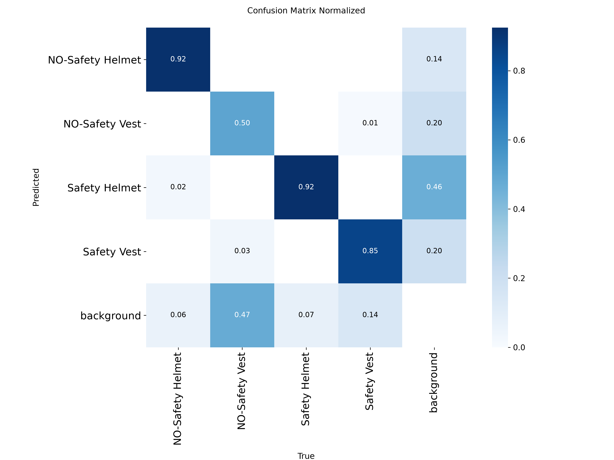
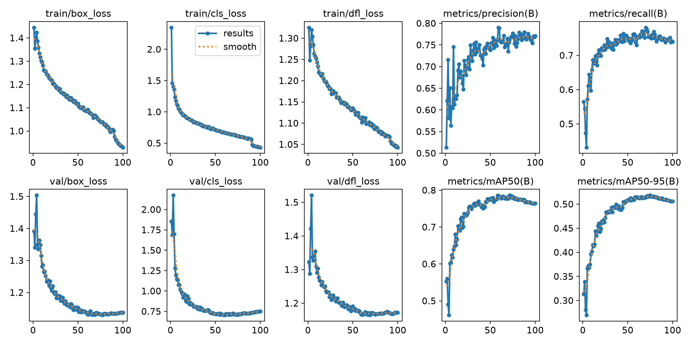
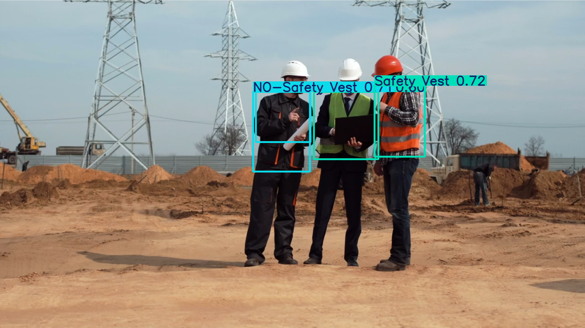
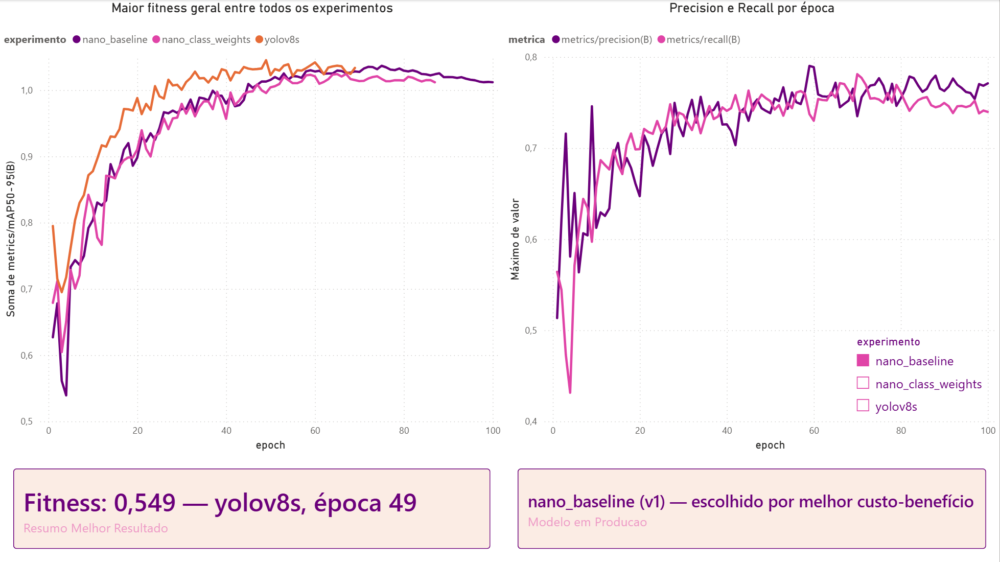

# DetectEPI — PPE Detection with YOLOv8

DetectEPI is a computer vision project that detects personal protective equipment (PPE) — hard hats and safety vests — in images and video, using a fine-tuned YOLOv8 model. Beyond the detection pipeline itself, this project documents a full experimentation workflow: model comparisons, a class-imbalance investigation, a domain-shift analysis on real-world footage, a containerized inference pipeline, automated tests, and an interactive Power BI dashboard comparing training runs.

## Table of Contents

- [Dataset](#dataset)
- [Environment](#environment)
- [Quick Start](#quick-start)
- [Training and Experiments](#training-and-experiments)
- [Per-Class Confidence Thresholds](#per-class-confidence-thresholds)
- [Domain Shift: Generalization Beyond the Dataset](#domain-shift-generalization-beyond-the-dataset)
- [Inference Pipeline](#inference-pipeline)
- [Docker](#docker)
- [Automated Tests](#automated-tests)
- [Power BI Dashboard](#power-bi-dashboard)
- [Limitations and Future Work](#limitations-and-future-work)

## Dataset

The model was fine-tuned on the **Hard Hat Universe** dataset (Roboflow), containing **8,051 images** across 4 classes:

- `Safety Helmet`
- `NO-Safety Helmet`
- `Safety Vest`
- `NO-Safety Vest`

## Environment

- Python 3.12.7 (isolated virtual environment)
- PyTorch with CUDA support
- GPU: NVIDIA RTX 3060 (12GB VRAM), 32GB system RAM
- Base architecture: YOLOv8n (nano)

## Quick Start

```bash
# Clone the repository
git clone https://github.com/Kines0124/DetectEPI.git
cd DetectEPI

# Create and activate a virtual environment
python -m venv venv
venv\Scripts\activate          # Windows
# source venv/bin/activate     # Linux/Mac

# Install dependencies (PyTorch with CUDA 12.1 support)
pip install --extra-index-url https://download.pytorch.org/whl/cu121 -r requirements.txt

# Run inference on an image
python src/infer.py --source path/to/image.jpg --mode image_filtered

# Or run the containerized version instead
docker build -t detectepi:v1 .
docker run --rm --gpus all -v "path/to/folder:/data" detectepi:v1 --source /data/image.jpg --mode image_filtered --output /data
```

## Training and Experiments

Three training experiments were run and compared to justify the final choice of production model. All experiments used `epochs=100`, `patience=20`, and the same dataset split.

### Experiment 1 — YOLOv8n, no class weighting (production model)

This is the baseline and the model currently used in production (`best.pt`).

- Backpropagation was used to iteratively adjust model weights and reduce prediction error over each epoch.
- Best epoch: **75** (fitness = 0.1 × mAP50 + 0.9 × mAP50-95 = **0.544792**)
- Shorter training runs (~50 epochs) showed mild underfitting; the full 100-epoch run showed mild overfitting past epoch ~70 (validation loss plateauing/slightly increasing while mAP50-95 and recall peaked and softly declined). This is why `best.pt` — not `last.pt` — is used in production.

**Official test-set metrics** (`model.val(split="test")`, 1,106 images):

| Class | Precision | Recall | mAP50 | mAP50-95 |
|---|---|---|---|---|
| all | 0.817 | 0.784 | 0.821 | 0.540 |
| NO-Safety Helmet | 0.900 | 0.896 | 0.928 | 0.637 |
| **NO-Safety Vest** | 0.621 | **0.553** | 0.548 | 0.291 |
| Safety Helmet | 0.889 | 0.872 | 0.923 | 0.624 |
| Safety Vest | 0.856 | 0.813 | 0.886 | 0.609 |

**Key finding:** `NO-Safety Vest` is the weakest class (lowest recall, fewest instances in the dataset: 226 vs. ~1,950 for `Safety Helmet`). The confusion matrix shows the dominant failure mode is the model **failing to detect** the object at all (falling into "background"), not confusing it with another class.




### Experiment 2 — Class weights (`cls_pw`), discarded

Ultralytics natively supports class weighting through the `cls_pw` parameter (0–1), which computes an inverse-frequency weight per class, normalized and applied to the BCE loss.

- Ran with `cls_pw=0.5`: computed weights `[0.903, 1.649, 0.527, 0.921]` (`NO-Safety Vest` received the highest weight, as expected).
- Training stopped early at epoch 87 (best at epoch 67, fitness **0.538374** — worse than the unweighted baseline).
- **Result:** recall for `NO-Safety Vest` barely moved (0.553 → 0.562), but **precision dropped across all classes** (e.g., `NO-Safety Vest` precision 0.621 → 0.490) — the model became more "trigger-happy" overall without actually solving the target problem.
- **Conclusion:** discarded. Class weighting did not resolve the recall gap on the minority class, and it hurt overall precision. The unweighted baseline remains the production model.

### Experiment 3 — YOLOv8s (small), discarded

Same training configuration as the baseline, using `yolov8s.pt` instead of `yolov8n.pt`.

- Training stopped at epoch 69, best at epoch **49** (fitness **0.548951**, slightly better than the nano baseline's 0.544792).

**Official test-set metrics:**

| Class | Precision | Recall | mAP50 | mAP50-95 |
|---|---|---|---|---|
| all | 0.814 | 0.803 | 0.832 | 0.546 |
| NO-Safety Helmet | 0.908 | 0.923 | 0.932 | 0.643 |
| **NO-Safety Vest** | 0.651 | **0.552** | 0.586 | 0.303 |
| Safety Helmet | 0.866 | 0.907 | 0.919 | 0.624 |
| Safety Vest | 0.832 | 0.830 | 0.892 | 0.614 |

- **Conclusion:** the overall gain is small (1–3 percentage points across most metrics), but recall on `NO-Safety Vest` barely changed (0.553 → 0.552, essentially identical) — confirming the class's weakness is structural (limited data / visual difficulty), not a lack of model capacity. The marginal gain does not justify the added training and inference cost, so the nano baseline remains the production model.

## Per-Class Confidence Thresholds

Instead of retraining again, the class-imbalance problem was mitigated at inference time using **per-class confidence thresholds**, decided by inspecting the precision-recall curves generated during validation.


`NO-Safety Vest`'s PR curve shows its "knee" around recall 0.6–0.65; beyond that point, precision drops sharply. A confidence threshold of **0.15** sits at the balance point for this class. Well-performing classes (`NO-Safety Helmet`, `Safety Helmet`) retain high recall (~0.90+) even under a stricter threshold, so they were kept higher to avoid unnecessary false positives.

**Final thresholds used in production:**

```python
class_thresholds = {
    "NO-Safety Helmet": 0.35,
    "NO-Safety Vest": 0.15,
    "Safety Helmet": 0.35,
    "Safety Vest": 0.3
}
```

Other mitigation options considered: targeted oversampling and augmentation of the minority class were discussed but not tested, as a conscious decision to avoid the risk of overfitting on a small, duplicated sample.

## Domain Shift: Generalization Beyond the Dataset

The model performs very well on data from the same distribution as the training/test set — but testing it against external footage (not part of the Hard Hat Universe dataset) revealed a different kind of limitation: **inconsistent detection under real-world conditions.**

A short external video (unrelated construction footage) was run through the inference pipeline. Detection of safety vests remained reliable, but hard-hat detection became noticeably inconsistent frame to frame — even in cases where a helmet was clearly visible to the human eye.



Diagnostic testing (running the raw model at very low confidence thresholds, without any class filtering) confirmed this was not a bug in the inference code, and not related to the class-imbalance issue described above. Camera angle, lighting, video compression artifacts, and helmet style/color outside the training distribution are the most likely causes.

**Conclusion:** the model generalizes well *within* the distribution of its training/test data (as shown by the strong official metrics above), but shows expected degradation on out-of-distribution footage — a classic domain-shift limitation. This is distinct from the `NO-Safety Vest` class-imbalance issue and would require a more visually diverse training set (more camera angles, lighting conditions, and helmet styles) or targeted fine-tuning to fully address. This was a conscious decision not to pursue further given project scope and time constraints.

For comparison, here is a batch of validation images from within the dataset distribution, showing consistent detection quality:


## Inference Pipeline

The `EPIDetector` class (in `src/infer.py`) exposes four prediction modes:

- `predict_image` / `predict_video` — single global confidence threshold
- `predict_image_filtered` / `predict_video_filtered` — per-class thresholds (production mode)

A shared, unit-tested helper function, `filter_boxes_by_threshold`, implements the per-class filtering logic used by both the image and video "filtered" modes.

### Command-line usage

```bash
python src/infer.py --source path/to/image_or_video --mode image_filtered --output path/to/output_dir
```

**Arguments:**

| Argument | Required | Default | Description |
|---|---|---|---|
| `--source` | Yes | — | Path to the input image or video |
| `--mode` | No | `image_filtered` | One of `image`, `image_filtered`, `video`, `video_filtered` |
| `--model` | No | `model/best.pt` | Path to the model weights |
| `--output` | No | `runs/inference` | Directory where the result is saved |

## Docker

The project ships with a Dockerfile that packages the full inference pipeline — Python 3.12, CUDA 12.1 runtime, all dependencies, the trained model, and the inference code — into a single, portable image, with GPU support.

### Build

```bash
docker build -t detectepi:v1 .
```

### Run (with GPU)

Mount a local folder containing your input file to `/data` inside the container; the same folder is used for the output, so results are written back to your host machine:

```bash
docker run --rm --gpus all -v "/absolute/path/to/your/folder:/data" detectepi:v1 --source /data/your_image.jpg --mode image_filtered --output /data
```

Omit `--gpus all` to run on CPU instead — the same image works either way.

**Notes:**
- The input folder must already exist on the host before running the container.
- The image is based on `nvidia/cuda:12.1.1-cudnn8-runtime-ubuntu22.04`, with Python 3.12 installed via the `deadsnakes` PPA (Ubuntu 22.04 ships with Python 3.10 by default, which is incompatible with some of this project's dependencies).

## Automated Tests

The project includes a small `pytest` suite (`tests/test_infer.py`) covering the parts of the pipeline that are meaningful to test with unit/integration tests — as opposed to model quality, which is already validated through the official metrics above:

1. **`filter_boxes_by_threshold` logic** — tested in isolation, using a lightweight fake `boxes` object, without loading the real model. Verifies that detections above/below the per-class threshold are correctly kept or discarded.
2. **Model loading** — verifies that `EPIDetector` successfully loads the trained weights.
3. **End-to-end pipeline** — runs `predict_image_filtered` on a real test image and confirms the full pipeline (model inference → per-class filtering → saving output) completes without error.

```bash
pytest tests/
```

## Power BI Dashboard

To compare the three training experiments visually, per-epoch training metrics (`results.csv` from each run) were consolidated into a single dataset and explored in Power BI.



The dashboard includes:
- A line chart of **mAP50-95 by epoch**, with one line per experiment — showing that YOLOv8s converges slightly faster/higher, while the nano baseline and class-weighted run follow a very similar curve.
- A line chart of **precision and recall by epoch**, filterable by experiment via a slicer — highlighting how the class-weighted run traded precision for a negligible recall gain (the finding that led to discarding that experiment).
- A summary card showing the **highest raw fitness score** across all experiments (YOLOv8s, epoch 49) alongside a second card stating the **model actually used in production** (nano baseline) and the reasoning for that choice — since the best raw metric and the best practical choice are not always the same thing.

## Limitations and Future Work

- **LLM-assisted dataset curation** — using a vision-language model to audit the dataset for mislabeled boxes, near-duplicate/low-quality images, and gaps in scene diversity (e.g., camera angles), which could directly help address the domain-shift limitation described above. Scoped as a future addition, not required for the current deliverable.
- **API exposure** — the inference pipeline is currently CLI-only. Wrapping it in a REST API (e.g., FastAPI) would allow programmatic access without needing to run the container interactively.
